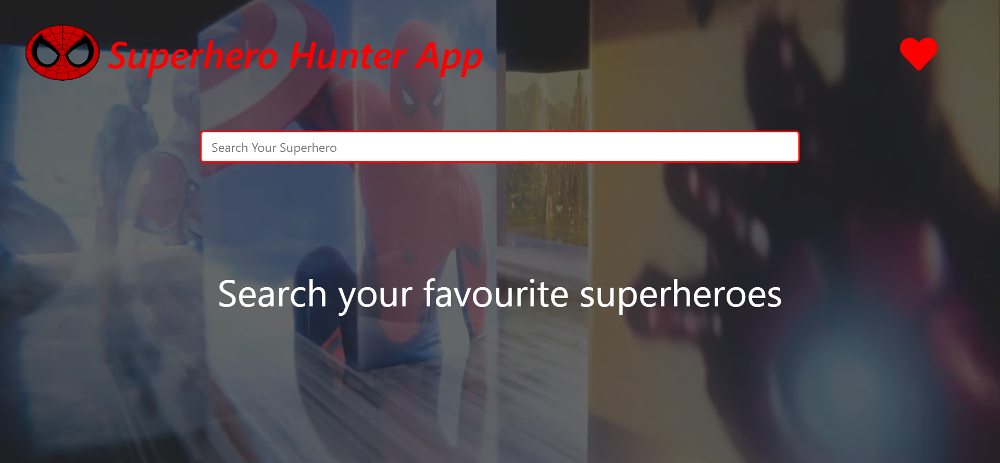
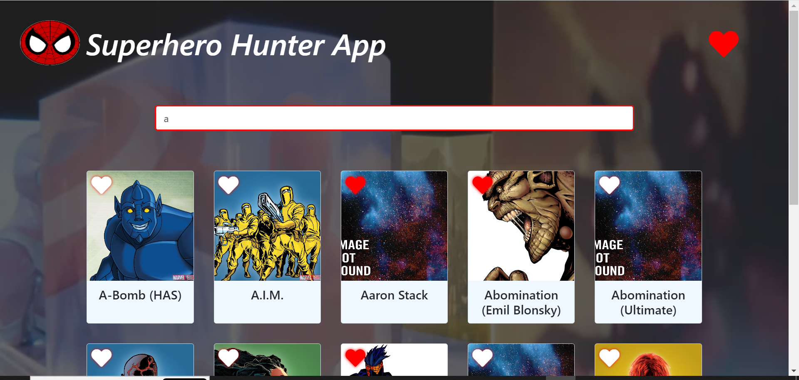
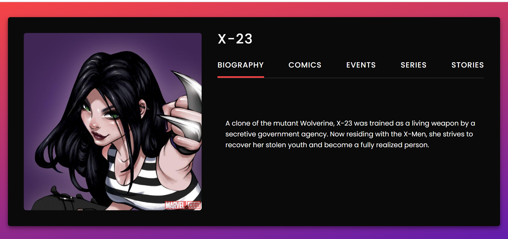
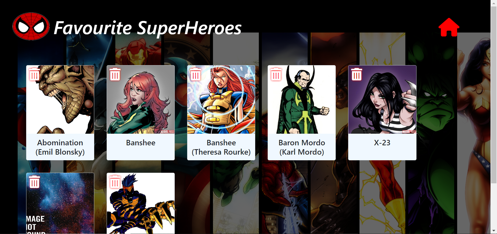

# Superhero Hunter App

The Superhero Hunter App is a web application that allows users to explore and discover information about their favorite superheroes from the Marvel universe. The app provides a user-friendly interface with the following features:

## Home Page

- **Superhero List**: The home page displays a list of superheroes (characters) fetched from the Marvel API. Each superhero entry includes their name and thumbnail image.

- **Search Bar**: Users can use the search bar to filter superheroes based on their search query. For example, typing "bat" will display "Batman" in the search results.

- **Add to Favorites**: Each superhero entry in the search results has a favorite button. Clicking on the favorite button adds the superhero to the user's "My Favorite Superheroes" list.

- **Superhero Details Page**: Clicking on any superhero entry in the search results will open a new page called the "Superhero Details Page." This page provides more comprehensive information about the selected superhero.

- **Interactive Background Video**: The home page features an engaging background video that adds visual appeal to the app. Clicking on the logo will toggle between playing and pausing the background video, allowing users to control the visual experience.

## Superhero Details Page

- **Superhero Information**: The Superhero Details Page displays detailed information about the selected superhero. This includes their name, photo (thumbnail), biography, and other relevant data provided by the Marvel API, such as comics, events, series, and stories in which the superhero appears.

## My Favorite Superheroes Page

- **Favorites List**: The "My Favorite Superheroes" page displays a list of all the superheroes that the user has added to their favorites.

- **Persistence**: The app ensures that the favorites list remains persistent even after closing the browser. The user's list of favorite superheroes will be preserved for future visits.

- **Delete from Favorites**: Each superhero entry in the favorites list has a delete icon. Clicking on this icon will remove the superhero from the user's favorites list.

## Technologies Used

- **Front-end**: The app is built using HTML, CSS, and JavaScript. It leverages the Bootstrap framework for responsive design and Font Awesome for icons.

- **API Integration**: The app fetches superhero data from the Marvel API. It uses the timestamp, public key, and private key to generate the required hash for API authentication.

- **LocalStorage**: The app utilizes the browser's LocalStorage to store and retrieve the user's favorite superheroes, ensuring persistent data storage.

## How to Use

1. Visit the home page of the Superhero Hunter App.

2. Explore the list of superheroes displayed on the home page.

3. Use the search bar to filter superheroes by name.

4. Click on the favorite button (heart icon) next to a superhero to add them to your "My Favorite Superheroes" list.

5. Click on a superhero's name or thumbnail to view detailed information on the "Superhero Details Page."

6. Access the "My Favorite Superheroes" page to view and manage your favorite superheroes.

7. Click on the delete icon (trash can icon) to remove a superhero from your favorites list.

8. The list of favorite superheroes will be saved even after closing the browser.

9. Enjoy an interactive experience on the home page by clicking on the logo to play/pause the background video.

## Author

This Superhero Hunter application is developed by Surbhi Pahwa. You can contact me at surbhipahwa36@gmail.com for any questions or inquiries related to this project.
